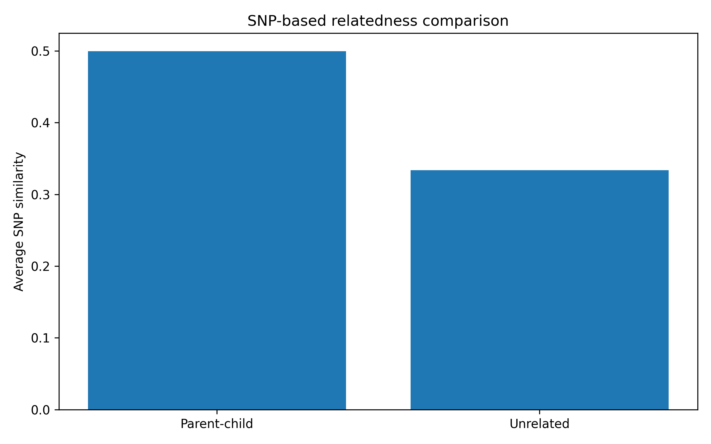
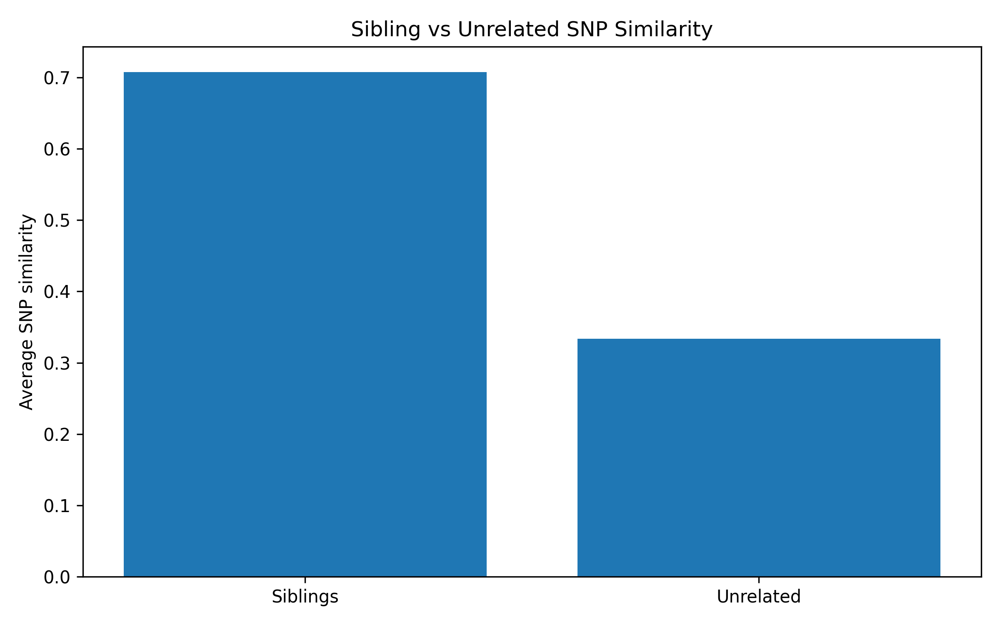
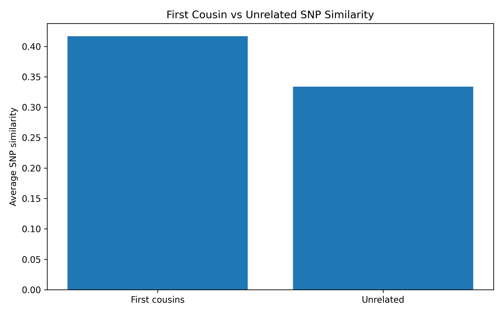

# Forensic Genetic Genealogy Lab

Educational forensic genomics project for simulating SNP-based relatedness estimation and forensic genetic genealogy workflows.

## Overview

Forensic genetic genealogy combines genomics, population genetics, and genealogical analysis to identify unknown individuals through biological relatives.

This project explores computational approaches for estimating genetic relatedness using simulated SNP profiles and Monte Carlo experiments.

The framework demonstrates how genetic similarity can distinguish close relatives from unrelated individuals.

---

## Scientific Motivation

Forensic genetic genealogy has become an important tool in:

* Missing persons investigations
* Human remains identification
* Disaster victim identification
* Cold case investigations
* Relationship inference
* Genealogical research

This project provides an educational introduction to SNP-based relatedness analysis and identity-by-descent concepts.

---

## SNP Relatedness Experiment

Evaluates genetic similarity between biological parents and their children using simulated SNP profiles.



Example results:

| Relationship | Average Similarity |
| ------------ | ------------------ |
| Parent-Child | 0.500              |
| Unrelated    | 0.334              |

Results show substantially higher SNP similarity between biological relatives than between unrelated individuals.

---

## Sibling Relatedness Experiment

Evaluates SNP similarity between biological siblings.



Example results:

| Relationship | Average Similarity |
| ------------ | ------------------ |
| Siblings     | 0.708              |
| Unrelated    | 0.334              |

Biological siblings share considerably more genetic information than unrelated individuals, demonstrating the usefulness of SNP-based relationship inference.

---

## First Cousin Relatedness Experiment

Evaluates genetic similarity between first cousins and unrelated individuals.



Example results:

| Relationship  | Average Similarity |
| ------------- | ------------------ |
| First Cousins | 0.417              |
| Unrelated     | 0.334              |

Although first cousins share less genetic material than siblings or parent-child pairs, they remain measurably more similar than unrelated individuals.

This experiment demonstrates how genetic genealogy methods can detect more distant biological relationships.

---

## Relationship Comparison

| Relationship  | Average SNP Similarity |
| ------------- | ---------------------- |
| Parent-Child  | ~0.50                  |
| Siblings      | ~0.71                  |
| First Cousins | ~0.42                  |
| Unrelated     | ~0.33                  |

The results demonstrate a clear decrease in genetic similarity with increasing genealogical distance.

---

## Identity-by-Descent (IBD)

Identity-by-Descent refers to genomic regions inherited from a common ancestor.

In forensic genetic genealogy, IBD sharing is commonly used to:

* Estimate biological relationships
* Prioritize potential relatives
* Support missing person identification
* Assist human remains identification

The experiments in this project provide simplified educational demonstrations of these concepts.

---

## Research Questions

1. How can SNP profiles be simulated computationally?
2. How can biological relatives be distinguished from unrelated individuals?
3. How does genetic similarity vary across different relationships?
4. How can forensic genetic genealogy support human identification?

---

## Methods

* SNP profile simulation
* Mendelian inheritance modeling
* Parent-child relatedness estimation
* Sibling relatedness estimation
* First cousin relatedness estimation
* Monte Carlo simulation
* Data visualization using Python

---

## Project Structure

```text
forensic-genetic-genealogy-lab/

├── reports/
│   ├── ibd_experiment.png
│   ├── sibling_ibd_experiment.png
│   ├── cousin_ibd_experiment.png
│   ├── ibd_results.csv
│   ├── sibling_ibd_results.csv
│   └── cousin_ibd_results.csv
│
├── src/
│   ├── snp_simulator.py
│   ├── relatedness.py
│   ├── ibd_experiment.py
│   ├── sibling_ibd_experiment.py
│   ├── cousin_ibd_experiment.py
│   ├── plot_ibd_results.py
│   ├── plot_sibling_ibd_results.py
│   └── plot_cousin_ibd_results.py
│
├── data/
├── notebooks/
├── tests/
│
├── requirements.txt
└── README.md
```

---

## Reproducibility

Install dependencies:

```bash
pip install -r requirements.txt
```

Run experiments:

```bash
python src/ibd_experiment.py
python src/sibling_ibd_experiment.py
python src/cousin_ibd_experiment.py
```

Generate plots:

```bash
python src/plot_ibd_results.py
python src/plot_sibling_ibd_results.py
python src/plot_cousin_ibd_results.py
```

---

## Future Work

* Identity-by-Descent segment simulation
* Shared centimorgan (cM) estimation
* Population structure modeling
* SNP frequency-based relatedness estimation
* Missing persons identification workflows
* Advanced forensic genetic genealogy methods
* Forensic ancestry inference

---

## Disclaimer

This project is intended for educational and research-training purposes only.

It is not validated for forensic casework and must not be used in real investigations.

---

## Author

Agata Gabara
